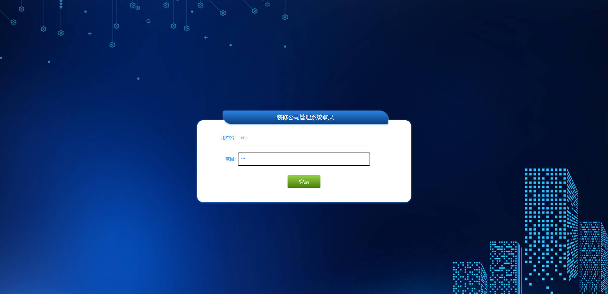

# 基于Springboot的装修公司管理系统 

# Springboot-001

### 技术栈

SSM mybatisplus vue

## 数据库

mysql (17张表)


## 运行截图

### 前台


### 后台




## 需要看运行视频或源码

```html
见images目录下面的a.txt文件

```


## 访问网址

### 前台

```
http://localhost:8080/springboot2z04j/front/dist/index.html#

账号 用户名2
密码 123456
```

### 后台

```
http://localhost:8080/springboot2z04j/admin/dist/index.html#

账号 admin
密码 admin
```


